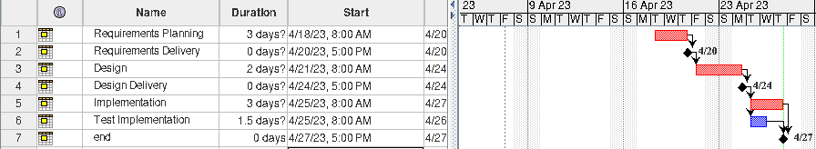

# Project Estimation - CURRENT

Date: 27/04/2023

Version: 1.0

# Estimation approach

Consider the EZWallet project in CURRENT version (as received by the teachers), assume that you are going to develop the project INDEPENDENT of the deadlines of the course

# Estimate by size

|                                                                                                         | Estimate  |
| ------------------------------------------------------------------------------------------------------- | --------- |
| NC = Estimated number of classes to be developed                                                        | 4         |
| A = Estimated average size per class, in LOC                                                            | 225 LOC   |
| S = Estimated size of project, in LOC (= NC \* A)                                                       | 900 LOC   |
| E = Estimated effort, in person hours (here use productivity 10 LOC per person hour)                    | 90 ph     |
| C = Estimated cost, in euro (here use 1 person hour cost = 30 euro)                                     | 2700      |
| Estimated calendar time, in calendar weeks (Assume team of 4 people, 8 hours per day, 5 days per week ) | 0.6 weeks |

# Estimate by product decomposition

###

| component name       | Estimated effort (person hours) |
| -------------------- | ------------------------------- |
| requirement document | 22ph                            |
| GUI prototype        | 8ph                             |
| design document      | 4ph                             |
| code                 | 24 ph                           |
| unit tests           | 8ph                             |
| api tests            | 4ph                             |
| management documents | 10ph                            |

# Estimate by activity decomposition

###

| Activity name         | Estimated effort (person hours) |
| --------------------- | ------------------------------- |
| Requirements Planning | 20ph                            |
| Design                | 12ph                            |
| Implementation        | 24ph                            |
| Test implementation   | 8ph                             |

###

# Summary

Report here the results of the three estimation approaches. The estimates may differ. Discuss here the possible reasons for the difference

|                                    | Estimated effort | Estimated duration |
| ---------------------------------- | ---------------- | ------------------ |
| estimate by size                   | 90hours          | 0.6 weeks          |
| estimate by product decomposition  | 80 hours         | 0.5 weeks          |
| estimate by activity decomposition | 64 hours         | 1.6 weeks              |

Possible differences could be that since the estimates are made on different criteria, different results are achieved.
