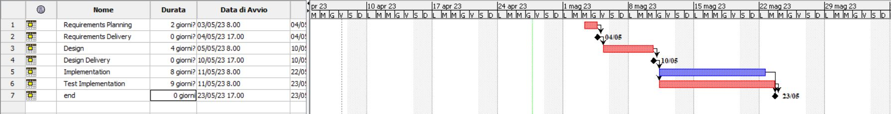

# Project Estimation - FUTURE
Date: 23/04/22

Version: 1.0

# Estimation approach
Consider the EZWallet  project in FUTURE version (as proposed by the team), assume that you are going to develop the project INDEPENDENT of the deadlines of the course
# Estimate by size
### 
|             | Estimate                        |             
| ----------- | ------------------------------- |  
| NC =  Estimated number of classes to be developed|5|             
| A = Estimated average size per class, in LOC| 500 LOC| 
| S = Estimated size of project, in LOC (= NC * A) |2500 LOC|
| E = Estimated effort, in person hours (here use productivity 10 LOC per person hour)  |250 ph|   
| C = Estimated cost, in euro (here use 1 person hour cost = 30 euro) | 7500| 
| Estimated calendar time, in calendar weeks (Assume team of 4 people, 8 hours per day, 5 days per week ) |1.6 weeks|               

# Estimate by product decomposition
### 
|         component name    | Estimated effort (person hours)   |             
| ----------- | -------------------------------                 | 
|requirement document       |48ph                               |
| GUI prototype             |24ph                               |
|design document            |24ph                               |
|code                       |56ph                               |
| unit tests                |24ph                               |
| api tests                 |16ph                               |
| management documents      |8ph                                |

# Estimate by activity decomposition
### 
|         Activity name    | Estimated effort (person hours)    |             
| ----------- | -------------------------------                 | 
|Requirements planning      |16ph                               |
|Design                     |32ph                               |
|Implementation             |64ph                               |
|Test Implementation        |72ph                               |
###

# Summary

Report here the results of the three estimation approaches. The  estimates may differ. Discuss here the possible reasons for the difference

|             | Estimated effort                        |   Estimated duration |          
| ----------- | ------------------------------- | ---------------|
| estimate by size |250 hours| 1.6 weeks|
| estimate by product decomposition | 200 hours| 1.3 weeks|
| estimate by activity decomposition | 160 hours| 4 weeks|

