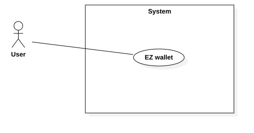
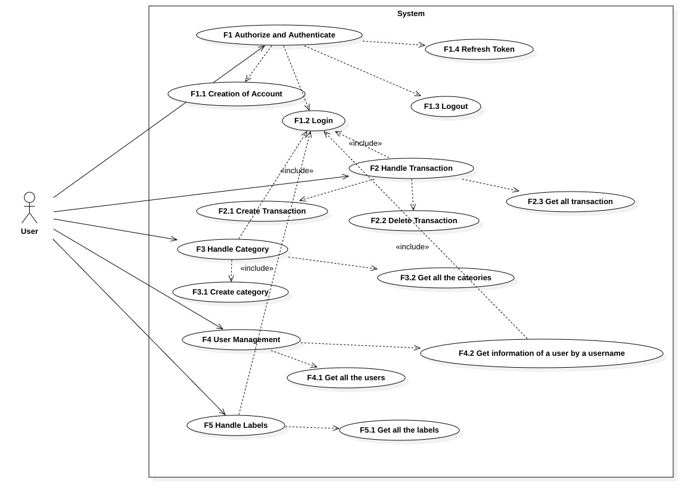
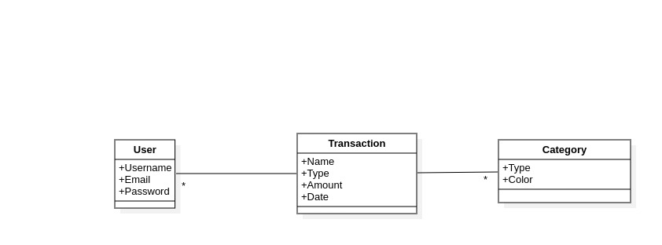
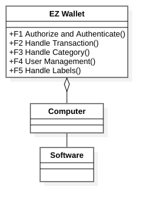

# Requirements Document - current EZWallet

Date: 21/04/2023

Version: V1 - description of EZWallet in CURRENT form (as received by teachers)

| Version number | Change                                               |
| -------------- | :--------------------------------------------------- |
| 1.1            | Added stakeholders, Context Diagram and Interfaces   |
| 1.2            | Added Functional and Non Functional requirements     |
| 1.3            | Added Use Case Diagram, Use Cases and Scenarios      |
| 1.4            | Added Glossary, System Design and Deployment Diagram |
| 1.5            | Apply some changes                                   |

# Contents

- [Informal description](#informal-description)
- [Stakeholders](#stakeholders)
- [Context Diagram and interfaces](#context-diagram-and-interfaces)
  - [Context Diagram](#context-diagram)
  - [Interfaces](#interfaces)
- [Stories and personas](#stories-and-personas)
- [Functional and non functional requirements](#functional-and-non-functional-requirements)
  - [Functional Requirements](#functional-requirements)
  - [Non functional requirements](#non-functional-requirements)
- [Use case diagram and use cases](#use-case-diagram-and-use-cases)
  - [Use case diagram](#use-case-diagram)
  - [Use cases](#use-cases)
    - [Relevant scenarios](#relevant-scenarios)
- [Glossary](#glossary)
- [System design](#system-design)
- [Deployment diagram](#deployment-diagram)
- [Defects](#defects)

# Informal description

EZWallet (read EaSy Wallet) is a software application designed to help individuals and families keep track of their expenses. Users can enter and categorize their expenses, allowing them to quickly see where their money is going. EZWallet is a powerful tool for those looking to take control of their finances and make informed decisions about their spending.

# Stakeholders

| Stakeholder name |        Description        |
| ---------------- | :-----------------------: |
| User             |    To manage expenses     |
| Developer        | Developes the application |

# Context Diagram and interfaces

## Context Diagram

## Interfaces

| Actor | Logical Interface |       Physical Interface |
| ----- | :---------------: | -----------------------: |
| User  | Screen, keyboard  | Graphical User Interface |

# Stories and personas

Persona1: female, young, student, low
income, not married

    Story: She needs to manage the money that her parents give her each month and she uses the app to constantly keep track her expenses.

Persona2: male, middle age, medium income, married with children, professional

    Story: He needs to keep track of the money spent by the family and the savings that can be set aside for any future investments or emergencies.

# Functional and non functional requirements

## Functional Requirements

| ID      |               Description               |
| ------- | :-------------------------------------: |
| **FR1** |     **Authorize and Authenticate**      |
| FR1.1   |           Creation of account           |
| FR1.2   |                 Log in                  |
| FR1.3   |                 Log out                 |
| FR1.4   |              Refresh token              |
|         |                                         |
| **FR2** |         **Handle transactions**         |
| FR2.1   |           Create transaction            |
| FR2.2   |           Delete transaction            |
| FR2.3   |        Get all the transactions         |
|         |                                         |
| **FR3** |          **Handle categories**          |
| FR3.1   |             Create category             |
| FR3.2   |         Get all the categories          |
|         |                                         |
| **FR4** |          **Users Management**           |
| FR4.1   |            Get all the users            |
| FR4.2   | Get information of a user by a username |
|         |                                         |
| **FR5** |            **Handle labels**            |
| FR5.1   |           Get all the labels            |

## Non Functional Requirements

| ID   | Type (efficiency, reliability, ..) |                                                                                                                                Description                                                                                                                                 |     Refers to |
| ---- | :--------------------------------: | :------------------------------------------------------------------------------------------------------------------------------------------------------------------------------------------------------------------------------------------------------------------------: | ------------: |
| NFR1 |             Efficiency             |                                                                                                                               less than 2sec                                                                                                                               |          F1.2 |
| NFR2 |            Reliability             |                                                                                                                  rate of failure occurrence less than 1%                                                                                                                   | Each function |
| NFR3 |             Usability              |                                                                                                                       Learning time about 10 minutes                                                                                                                       | Each function |
| NFR4 |               Domain               | The application should be accessed by Chrome (version 81 and more recent), and Safari (version 13 and more recent) (this covers around 80% of installed browsers); and from the operating systems where these browsers are available (Android, IoS, Windows, MacOS, Unix). | Each function |

| NFR5 | Domain               |  Date format is YYYY-MM-DD | FR2 |
| NFR6 | Domain               | Currency is expressed in Euro | FR2 |
# Use case diagram and use cases

## Use case diagram

### Use case 1.1, UC1.1 CREATION OF ACCOUNT

| Actors Involved  |                      Users                      |
| ---------------- | :---------------------------------------------: |
| Precondition     |          Be in possession of an email           |
| Post condition   |                 Account created                 |
| Nominal Scenario | User inserts valid username, email and password |
| Variants         |    Username, email or password are not valid    |
| Exceptions       |         Creation of account is aborted          |

##### Scenario 1.1.1

| Scenario 1.1.1 |                                           |
| -------------- | :---------------------------------------: |
| Precondition   |             User has an email             |
| Post condition |              Account created              |
| Step#          |                Description                |
| 1              |  User starts account creation procedure   |
| 2              | User inserts username, email and password |
| 3              |         Credentials are evaluated         |
| 4              |          Credentials are correct          |
| 5              |            Account is created             |

##### Scenario 1.1.2

| Scenario 1.1.2 |                                           |
| -------------- | :---------------------------------------: |
| Precondition   |             User has an email             |
| Post condition |           Account isn't created           |
| Step#          |                Description                |
| 1              |  User starts account creation procedure   |
| 2              | User inserts username, email and password |
| 3              |         Credentials are evaluated         |
| 4              |        Credentials aren't correct         |
| 5              |           Account isn't created           |

### Use case 1.2, UC1.2 LOGIN

| Actors Involved  |                 Users                 |
| ---------------- | :-----------------------------------: |
| Precondition     |    Be in possession of an account     |
| Post condition   |           Successful log in           |
| Nominal Scenario | User inserts valid email and password |
| Variants         |    Email or password are not valid    |
| Exceptions       |           Log in is aborted           |

##### Scenario 1.2.1

| Scenario 1.2.1 |                                 |
| -------------- | :-----------------------------: |
| Precondition   |       User has an account       |
| Post condition |        Successful log in        |
| Step#          |           Description           |
| 1              |  User starts log in procedure   |
| 2              | User inserts email and password |
| 3              |    Credentials are evaluated    |
| 4              |     Credentials are correct     |
| 5              |        User in logged in        |

##### Scenario 1.2.2

| Scenario 1.2.2 |                                 |
| -------------- | :-----------------------------: |
| Precondition   |     User hasn't an account      |
| Post condition |       unsuccessful log in       |
| Step#          |           Description           |
| 1              |  User starts log in procedure   |
| 2              | User inserts email and password |
| 3              |    Credentials are evaluated    |
| 4              |   Credentials aren't correct    |
| 5              |      User isn't logged in       |

### Use case 1.3, UC1.3 LOGOUT

| Actors Involved  |             Users             |
| ---------------- | :---------------------------: |
| Precondition     |       User is logged in       |
| Post condition   |      Successful log out       |
| Nominal Scenario | User clicks on log out button |
| Variants         |                               |
| Exceptions       |                               |

##### Scenario 1.3.1

| Scenario 1.3.1 |                              |
| -------------- | :--------------------------: |
| Precondition   |      User is logged in       |
| Post condition |      User in logged out      |
| Step#          |         Description          |
| 1              | User click on log out button |
| 2              |      User is Logged out      |

### Use case 1.4, UC1.4 REFRESH TOKEN

| Actors Involved  |       Users       |
| ---------------- | :---------------: |
| Precondition     | User is logged in |
| Post condition   |  Token refreshed  |
| Nominal Scenario |                   |
| Variants         |                   |
| Exceptions       |                   |

##### Scenario 1.4.1

| Scenario 1.4.1 |                    |
| -------------- | :----------------: |
| Precondition   | User is logged in  |
| Post condition | Token is refreshed |
| Step#          |    Description     |
| 1              |                    |
| 2              |                    |

### Use case2.1, UC2.1 CREATE TRANSACTION

| Actors Involved  |                          Users                          |
| ---------------- | :-----------------------------------------------------: |
| Precondition     |                    User is logged in                    |
| Post condition   |                 Transaction is created                  |
| Nominal Scenario |    User inserts correct name, type, amount and date     |
| Variants         | User doesn't insert correct name, type, amount and date |
| Exceptions       |                Transaction isn't create                 |

##### Scenario 2.1.1

| Scenario 2.1.1 |                                                    |
| -------------- | :------------------------------------------------: |
| Precondition   |                 User is logged in                  |
| Post condition |               Transaction is created               |
| Step#          |                    Description                     |
| 1              |           User create a new transaction            |
| 2              | Application evaluates the transaction successfully |
| 3              |               Transaction is created               |

##### Scenario 2.1.2

| Scenario 2.1.2 |                                                      |
| -------------- | :--------------------------------------------------: |
| Precondition   |                  User is logged in                   |
| Post condition |              Transaction isn't created               |
| Step#          |                     Description                      |
| 1              |            User create a new transaction             |
| 2              | Application evaluates the transaction unsuccessfully |
| 3              |              Transaction isn't created               |

### Use case2.2, UC2.2 DELETE TRANSACTION

| Actors Involved  |                   Users                    |
| ---------------- | :----------------------------------------: |
| Precondition     | User is logged in and a transaction exists |
| Post condition   |           Transaction is deleted           |
| Nominal Scenario |  User clicks on delete transaction button  |
| Variants         |                                            |
| Exceptions       |                                            |

##### Scenario 2.2.1

| Scenario 2.2.1 |                                            |
| -------------- | :----------------------------------------: |
| Precondition   | User is logged in and a transaction exists |
| Post condition |           Transaction is deleted           |
| Step#          |                Description                 |
| 1              |  User clicks on delete transaction button  |
| 2              |           Transaction is deleted           |

### Use case2.3, UC2.3 GET ALL THE TRANSACTIONS

| Actors Involved  |                          Users                           |
| ---------------- | :------------------------------------------------------: |
| Precondition     |                    User is logged in                     |
| Post condition   |              User sees all the transactions              |
| Nominal Scenario | User clicks on the button which get all the transactions |
| Variants         |                                                          |
| Exceptions       |                                                          |

##### Scenario 2.3.1

| Scenario 2.3.1 |                                                          |
| -------------- | :------------------------------------------------------: |
| Precondition   |                    User is logged in                     |
| Post condition |              User sees all the transactions              |
| Step#          |                       Description                        |
| 1              | User clicks on the button which get all the transactions |
| 2              |              User sees all the transactions              |

### Use case3.1, UC3.1 CREATE CATEGORY

| Actors Involved  |                   Users                    |
| ---------------- | :----------------------------------------: |
| Precondition     |             User is logged in              |
| Post condition   |            Category is created             |
| Nominal Scenario |    User inserts correct type and color     |
| Variants         | User doesn't insert correct type and color |
| Exceptions       |           Category isn't create            |

##### Scenario 3.1.1

| Scenario 3.1.1 |                                                 |
| -------------- | :---------------------------------------------: |
| Precondition   |                User is logged in                |
| Post condition |               Category is created               |
| Step#          |                   Description                   |
| 1              |           User create a new category            |
| 2              | Application evaluates the category successfully |
| 3              |               Category is created               |

##### Scenario 3.1.2

| Scenario 3.1.2 |                                                   |
| -------------- | :-----------------------------------------------: |
| Precondition   |                 User is logged in                 |
| Post condition |              category isn't created               |
| Step#          |                    Description                    |
| 1              |            User create a new category             |
| 2              | application evaluates the category unsuccessfully |
| 3              |              category isn't created               |

### Use case3.2, UC3.2 GET ALL THE CATEGORIES

| Actors Involved  |                         Users                          |
| ---------------- | :----------------------------------------------------: |
| Precondition     |                   User is logged in                    |
| Post condition   |              User sees all the categories              |
| Nominal Scenario | User clicks on the button which get all the categories |
| Variants         |                                                        |
| Exceptions       |                                                        |

##### Scenario 3.2.1

| Scenario 3.2.1 |                                                        |
| -------------- | :----------------------------------------------------: |
| Precondition   |                   User is logged in                    |
| Post condition |              User sees all the categories              |
| Step#          |                      Description                       |
| 1              | User clicks on the button which get all the categories |
| 2              |              User sees all the categories              |

### Use case4.1, UC4.1 GET ALL THE USERS

| Actors Involved  |                       User                        |
| ---------------- | :-----------------------------------------------: |
| Precondition     |            Administrator is logged in             |
| Post condition   |             list of users is returned             |
| Nominal Scenario | User clicks on the button which get all the users |
| Variants         |                                                   |
| Exceptions       |                                                   |

##### Scenario 4.1.1

| Scenario 4.1.1 |                                               |
| -------------- | :-------------------------------------------: |
| Precondition   |               User is logged in               |
| Post condition |           list of users is returned           |
| Step#          |                  Description                  |
| 1              | User clicks on button which get all the users |
| 2              |           list of users is returned           |

### Use case4.2, UC4.2 GET INFORMATION OF A USER BY A USERNAME

| Actors Involved  |                               User                               |
| ---------------- | :--------------------------------------------------------------: |
| Precondition     |                        User is logged in                         |
| Post condition   |           User sees the information of a specific user           |
| Nominal Scenario | User inserts the username and the user information are displayed |
| Variants         |                  User inserts a wrong username                   |
| Exceptions       |                   A message error is displayed                   |

##### Scenario 4.2.1

| Scenario 4.2.1 |                                                                  |
| -------------- | :--------------------------------------------------------------: |
| Precondition   |                        User is logged in                         |
| Post condition | User sees the information of a specific user or an error message |
| Step#          |                           Description                            |
| 1              |                    User inserts the username                     |
| 2              |                  Username is searched in the db                  |
| 3              |                         Username exists                          |
| 4              |                  User information is displayed                   |

##### Scenario 4.2.2

| Scenario 4.2.2 |                                |
| -------------- | :----------------------------: |
| Precondition   |       User is logged in        |
| Post condition |   User sees an error message   |
| Step#          |          Description           |
| 1              |   User inserts the username    |
| 2              | Username is searched in the db |
| 3              |    Username doesn't exists     |
| 4              | An error message is displayed  |

### Use case5.1, UC5.1 GET ALL THE LABELS

| Actors Involved  |                            User                             |
| ---------------- | :---------------------------------------------------------: |
| Precondition     |                      User is logged in                      |
| Post condition   |                 List of labels is returned                  |
| Nominal Scenario | User click on a button which returns the list of the labels |
| Variants         |                                                             |
| Exceptions       |                                                             |

##### Scenario 5.1.1

| Scenario 5.1.1 |                                                             |
| -------------- | :---------------------------------------------------------: |
| Precondition   |                      User is logged in                      |
| Post condition |                 List of labels is returned                  |
| Step#          |                         Description                         |
| 1              | User click on a button which returns the list of the labels |
| 2              |                 List of labels is displayed                 |

# Glossary

# System Design

# Deployment Diagram

# Defects

In the application there are some defects:

- **Labels**: the function get_Labels returns only the attributes of the transactions and not the join attributes of the tables Transaction and Category, so is the same as the function get_Transaction;
- **Privacy**: All the users reads and writes on the same wallet so one user can views all the transactions and the categories created by the other users and this isn't a good choice;
- **Cookies**:
- **getUsers**: This function returns a list of users and it is a function which is used by an admin and not a normal user;
