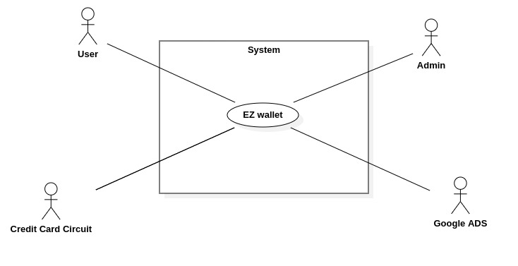
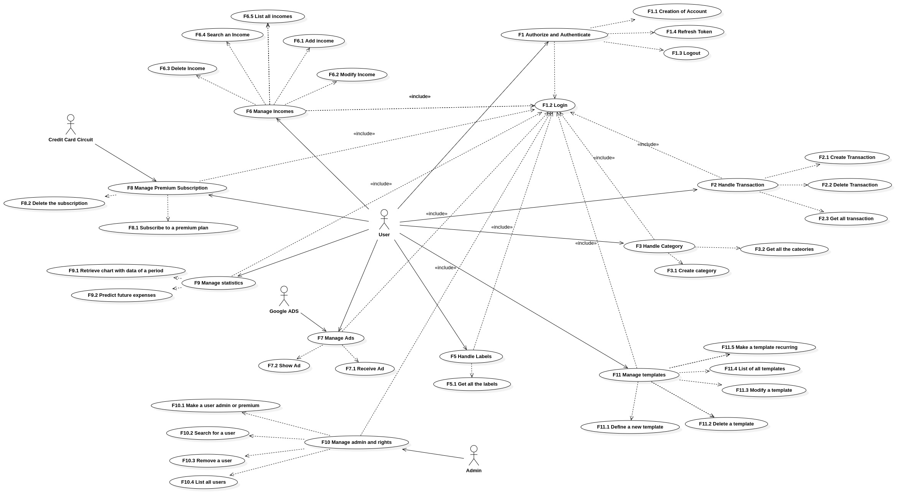
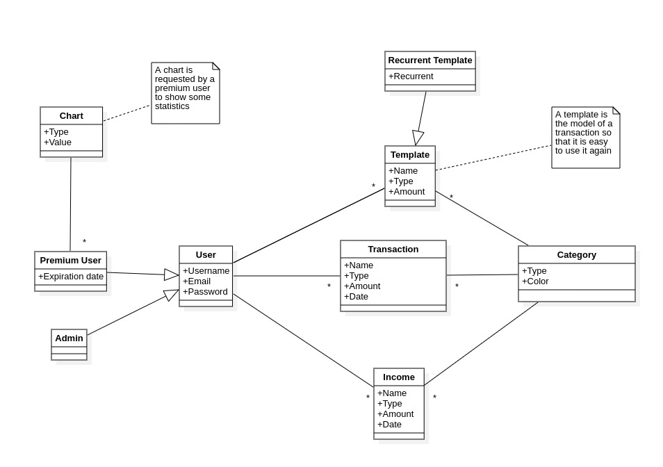
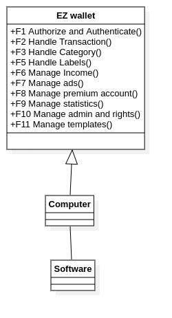
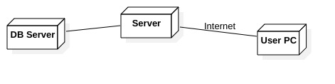

# Requirements Document - future EZWallet

Date:

Version: V2 - description of EZWallet in FUTURE form (as proposed by the team)

| Version number | Change                                               |
| -------------- | :--------------------------------------------------- |
| 1.0            | Added stakeholders, interfaces, stories and personas |
| 1.0.1          | Added Functional and Non Functional Requirements     |
| 1.0.2          | Updating NFR and FR                                  |
| 1.0.3          | Added UCs and Scenarios                              |
| 1.1            | Added images                                         |

# Contents

- [Informal description](#informal-description)
- [Stakeholders](#stakeholders)
- [Context Diagram and interfaces](#context-diagram-and-interfaces)
  - [Context Diagram](#context-diagram)
  - [Interfaces](#interfaces)
- [Stories and personas](#stories-and-personas)
- [Functional and non functional requirements](#functional-and-non-functional-requirements)
  - [Functional Requirements](#functional-requirements)
  - [Non functional requirements](#non-functional-requirements)
- [Use case diagram and use cases](#use-case-diagram-and-use-cases)
  - [Grants](#grants)
  - [Use case diagram](#use-case-diagram)
  - [Use cases](#use-cases) + [Relevant scenarios](#relevant-scenarios)
- [Glossary](#glossary)
- [System design](#system-design)
- [Deployment diagram](#deployment-diagram)

# Informal description

EZWallet (read EaSy Wallet) is a software application designed to help individuals and families keep track of their expenses. Users can enter and categorize their expenses, allowing them to quickly see where their money is going. EZWallet is a powerful tool for those looking to take control of their finances and make informed decisions about their spending.

In V2, we add a business model to our application: we have a **free web-based application** with advertisements, and a **premium feature** (1.99€/month) to remove them and get extra functionalities.

# Stakeholders

| Stakeholder name    |                         Description                         |
| ------------------- | :---------------------------------------------------------: |
| Users               |                             V1                              |
| Admin               | Has the ability to remove users and change their privileges |
| Google ADS          |          Provides the advertisements functionality          |
| Credit Card Circuit |                  Handles payment services                   |

# Context Diagram and interfaces

## Context Diagram

## Interfaces

| Actor               |  Logical Interface  |      Physical Interface |
| ------------------- | :-----------------: | ----------------------: |
| Users               | UI, Web Application | Screen, Keyboard, Mouse |
| Admin               | UI, Web Application | Screen, Keyboard, Mouse |
| Google ADS          |         API         |           Internet link |
| Credit Card Circuit |         API         |           Internet link |

# Stories and personas

Agnese is 18, he moved to Turin to study Computer Engineering and, for the first time in her life, she has to manage her finances. She needs to be aware of how much money she spends in each possible category of expenses. She teaches Italian to foreign students and she gets paid for that, so she would like to track the incomes as well. She does not care about the statistics and the charts.

Cosimo is 35 and his son was born 20 days ago. He has a full-time job as a nurse: although the salary is above the average in Italy, he wants to check how much the family is spending, in order to save some money each month. He is willing to pay some extra money to get statistics on his data, since he is not competent enough to do it on his own.

José is 25 from Brazil, and he came to Turin for an internship. He has to pay the rent for his room and bills, so he needs a way to track money. He has many subscriptions to online services (Spotify, Netflix and Tinder Plus), and he would like to add them to his expenses easily at the beginning of each month, since the kind of expense is always the same.

# Functional and non functional requirements

## Functional Requirements

Functional requirements 4 has been eliminated from V1 since it is now included inside the admin's capabilities; however, we left the previous numeration, skipping that number. 

| ID       |               Description               |
| -------- | :-------------------------------------: |
| **FR1**  |     **Authorize and Authenticate**      |
| FR1.1    |           Creation of account           |
| FR1.2    |                 Log in                  |
| FR1.3    |                 Log out                 |
| FR1.4    |              Refresh token              |
|          |                                         |
| **FR2**  |         **Handle transactions**         |
| FR2.1    |           Create transaction            |
| FR2.2    |           Delete transaction            |
| FR2.3    |        Get all the transactions         |
|          |                                         |
| **FR3**  |          **Handle categories**          |
| FR3.1    |             Create category             |
| FR3.2    |         Get all the categories          |
|          |                                         |
| **FR5**  |            **Handle labels**            |
| FR5.1    |           Get all the labels            |
|          |
| **FR6**  |           **Manage incomes**            |
| FR6.1    |               Add income                |
| FR6.2    |              Modify income              |
| FR6.3    |              Delete income              |
| FR6.4    |            Search an income             |
| FR6.5    |            List all incomes             |
|          |
| **FR7**  |             **Manage ads**              |
| FR7.1    |               Receive ad                |
| FR7.2    |                 Show ad                 |
|          |
| **FR8**  |     **Manage Premium Subscription**     |
| FR8.1    |       Subscribe to a premium plan       |
| FR8.2    |         Delete the subscription         |
|          |
| **FR9**  |          **Manage statistics**          |
| FR9.1    |  Retrieve chart with data of a period   |
| FR9.2    |         Predict future expenses         |
|          |
| **FR10** |       **Manage admin and rights**       |
| FR10.1   | Make a user admin or premium subscriber |
| FR10.2   |            Search for a user            |
| FR10.3   |              Remove a user              |
| FR10.4   |             List all users              |
|          |
| **FR11** |          **Manage templates**           |
| FR11.1   |  Define a new template for an expense   |
| FR11.2   |            Delete a template            |
| FR11.3   |            Modify a template            |
| FR11.4   |          List of all templates          |
| FR11.5   |        Make a template recurring        |

## Non Functional Requirements

| ID   | Type (efficiency, reliability, ..) |                                                                                                                                Description                                                                                                                                |  Refers to |
| ---- | :--------------------------------: | :-----------------------------------------------------------------------------------------------------------------------------------------------------------------------------------------------------------------------------------------------------------------------: | ---------: |
| NFR1 |             Usability              |                                                                                                   Application should be used without a specific training for the users                                                                                                    |     All FR |
| NFR2 |            Performance             |                                                                                                                All functions should be completed in <0.5s                                                                                                                 |     All FR |
| NFR3 |              Privacy               |                                                                                                        The data of one user should not be disclosed to other users                                                                                                        |     ALL FR |
| NFR4 |               Domain               |                                                                                                                        Currency expressed in euro                                                                                                                         |      FR1-4 |
| NFR5 |               Domain               |                                                                                                                         Date format is YYYY-MM-DD                                                                                                                         | FR 3-4-5-6 |
| NFR6 |            Portability             | The application should be accessed by Chrome (version 81 and more recent), and Safari (version 13 and more recent) (this covers around 80% of installed browsers); and from the operating systems where these browsers are available (Android, IoS, Windows, MacOS, Unix) |     All FR |
| NFR7 |               Domain               |                                                                                                Premium subscription should be renewed monthly, unless it has been removed                                                                                                 |        FR3 |

# Use case diagram and use cases

## Grants

|             Functional requirement             | User | Admin | Google Ads | Credit Card Circuit |
| :--------------------------------------------: | :--: | :---: | :--------: | :-----------------: |
|         FR1 Authorize and Authenticate         |  X   |   X   |            |                     |
|           FR1.1 Creation of account            |  X   |       |            |                     |
|                  FR1.2 Log in                  |  X   |   X   |            |                     |
|                 FR1.3 Log out                  |  X   |   X   |            |                     |
|              FR1.4 Refresh token               |  X   |   X   |            |                     |
|            FR2 Handle transactions             |  X   |       |            |                     |
|            FR2.1 Create transaction            |  X   |       |            |                     |
|            FR2.2 Delete transaction            |  X   |       |            |                     |
|         FR2.3 Get all the transactions         |  X   |       |            |                     |
|             FR3 Handle categories              |  X   |       |            |                     |
|             FR3.1 Create category              |  X   |       |            |                     |
|          FR3.2 Get all the categories          |  X   |       |            |                     |
|               FR5 Handle labels                |  X   |       |            |                     |
|            FR5.1 Get all the labels            |  X   |       |            |                     |
|               FR6 Manage incomes               |  X   |       |            |                     |
|                FR6.1 Add income                |  X   |       |            |                     |
|              FR6.2 Modify income               |  X   |       |            |                     |
|              FR6.3 Delete income               |  X   |       |            |                     |
|             FR6.4 Search an income             |  X   |       |            |                     |
|             FR6.5 List all incomes             |  X   |       |            |                     |
|                 FR7 Manage ads                 |  X   |       |     X      |                     |
|                FR7.1 Receive ad                |  X   |       |     X      |                     |
|                 FR7.2 Show ad                  |  X   |       |     X      |                     |
|        FR8 Manage Premium Subscription         |  X   |       |            |          X          |
|       FR8.1 Subscribe to a premium plan        |  X   |       |            |          X          |
|         FR8.2 Delete the subscription          |  X   |       |            |          X          |
|             FR9 Manage statistics              |  X   |       |            |                     |
|   FR9.1 Retrieve chart with data of a period   |  X   |       |            |                     |
|         FR9.2 Predict future expenses          |  X   |       |            |                     |
|          FR10 Manage admin and rights          |  X   |       |            |                     |
| FR10.1 Make a user admin or premium subscriber |      |   X   |            |                     |
|            FR10.2 Search for a user            |      |   X   |            |                     |
|              FR10.3 Remove a user              |      |   X   |            |                     |
|             FR10.4 List all users              |      |   X   |            |                     |
|             FR11 Manage templates              |  X   |       |            |                     |
|  FR11.1 Define a new template for an expense   |  X   |       |            |                     |
|            FR11.2 Delete a template            |  X   |       |            |                     |
|            FR11.3 Modify a template            |  X   |       |            |                     |
|          FR11.4 List of all templates          |  X   |       |            |                     |
|        FR11.5 Make a template recurring        |  X   |       |            |                     |

## Use case diagram

### Use case 1.1, UC1.1 CREATION OF ACCOUNT

| Actors Involved  |                      Users                      |
| ---------------- | :---------------------------------------------: |
| Precondition     |          Be in possession of an email           |
| Post condition   |                 Account created                 |
| Nominal Scenario | User inserts valid username, email and password |
| Variants         |    Username, email or password are not valid    |
| Exceptions       |         Creation of account is aborted          |

##### Scenario 1.1.1

| Scenario 1.1.1 |                                           |
| -------------- | :---------------------------------------: |
| Precondition   |             User has an email             |
| Post condition |              Account created              |
| Step#          |                Description                |
| 1              |  User starts account creation procedure   |
| 2              | User inserts username, email and password |
| 3              |         Credentials are evaluated         |
| 4              |          Credentials are correct          |
| 5              |            Account is created             |

##### Scenario 1.1.2

| Scenario 1.1.2 |                                           |
| -------------- | :---------------------------------------: |
| Precondition   |             User has an email             |
| Post condition |           Account isn't created           |
| Step#          |                Description                |
| 1              |  User starts account creation procedure   |
| 2              | User inserts username, email and password |
| 3              |         Credentials are evaluated         |
| 4              |        Credentials aren't correct         |
| 5              |           Account isn't created           |

### Use case 1.2, UC1.2 LOGIN

| Actors Involved  |                 Users                 |
| ---------------- | :-----------------------------------: |
| Precondition     |    Be in possession of an account     |
| Post condition   |           Successful log in           |
| Nominal Scenario | User inserts valid email and password |
| Variants         |    Email or password are not valid    |
| Exceptions       |           Log in is aborted           |

##### Scenario 1.2.1

| Scenario 1.2.1 |                                 |
| -------------- | :-----------------------------: |
| Precondition   |       User has an account       |
| Post condition |        Successful log in        |
| Step#          |           Description           |
| 1              |  User starts log in procedure   |
| 2              | User inserts email and password |
| 3              |    Credentials are evaluated    |
| 4              |     Credentials are correct     |
| 5              |        User in logged in        |

##### Scenario 1.2.2

| Scenario 1.2.2 |                                 |
| -------------- | :-----------------------------: |
| Precondition   |     User hasn't an account      |
| Post condition |       unsuccessful log in       |
| Step#          |           Description           |
| 1              |  User starts log in procedure   |
| 2              | User inserts email and password |
| 3              |    Credentials are evaluated    |
| 4              |   Credentials aren't correct    |
| 5              |      User isn't logged in       |

### Use case 1.3, UC1.3 LOGOUT

| Actors Involved  |             Users             |
| ---------------- | :---------------------------: |
| Precondition     |       User is logged in       |
| Post condition   |      Successful log out       |
| Nominal Scenario | User clicks on log out button |
| Variants         |                               |
| Exceptions       |                               |

##### Scenario 1.3.1

| Scenario 1.3.1 |                              |
| -------------- | :--------------------------: |
| Precondition   |      User is logged in       |
| Post condition |      User in logged out      |
| Step#          |         Description          |
| 1              | User click on log out button |
| 2              |      User is Logged out      |

### Use case 1.4, UC1.4 REFRESH TOKEN

| Actors Involved  |       Users       |
| ---------------- | :---------------: |
| Precondition     | User is logged in |
| Post condition   |  Token refreshed  |
| Nominal Scenario |                   |
| Variants         |                   |
| Exceptions       |                   |

##### Scenario 1.4.1

| Scenario 1.4.1 |                    |
| -------------- | :----------------: |
| Precondition   | User is logged in  |
| Post condition | Token is refreshed |
| Step#          |    Description     |
| 1              |                    |
| 2              |                    |

### Use case2.1, UC2.1 CREATE TRANSACTION

| Actors Involved  |                          Users                          |
| ---------------- | :-----------------------------------------------------: |
| Precondition     |                    User is logged in                    |
| Post condition   |                 Transaction is created                  |
| Nominal Scenario |    User inserts correct name, type, amount and date     |
| Variants         | User doesn't insert correct name, type, amount and date |
| Exceptions       |                Transaction isn't create                 |

##### Scenario 2.1.1

| Scenario 2.1.1 |                                                    |
| -------------- | :------------------------------------------------: |
| Precondition   |                 User is logged in                  |
| Post condition |               Transaction is created               |
| Step#          |                    Description                     |
| 1              |           User create a new transaction            |
| 2              | Application evaluates the transaction successfully |
| 3              |               Transaction is created               |

##### Scenario 2.1.2

| Scenario 2.1.2 |                                                      |
| -------------- | :--------------------------------------------------: |
| Precondition   |                  User is logged in                   |
| Post condition |              Transaction isn't created               |
| Step#          |                     Description                      |
| 1              |            User create a new transaction             |
| 2              | Application evaluates the transaction unsuccessfully |
| 3              |              Transaction isn't created               |

### Use case2.2, UC2.2 DELETE TRANSACTION

| Actors Involved  |                   Users                    |
| ---------------- | :----------------------------------------: |
| Precondition     | User is logged in and a transaction exists |
| Post condition   |           Transaction is deleted           |
| Nominal Scenario |  User clicks on delete transaction button  |
| Variants         |                                            |
| Exceptions       |                                            |

##### Scenario 2.2.1

| Scenario 2.2.1 |                                            |
| -------------- | :----------------------------------------: |
| Precondition   | User is logged in and a transaction exists |
| Post condition |           Transaction is deleted           |
| Step#          |                Description                 |
| 1              |  User clicks on delete transaction button  |
| 2              |           Transaction is deleted           |

### Use case2.3, UC2.3 GET ALL THE TRANSACTIONS

| Actors Involved  |                          Users                           |
| ---------------- | :------------------------------------------------------: |
| Precondition     |                    User is logged in                     |
| Post condition   |              User sees all the transactions              |
| Nominal Scenario | User clicks on the button which get all the transactions |
| Variants         |                                                          |
| Exceptions       |                                                          |

##### Scenario 2.3.1

| Scenario 2.3.1 |                                                          |
| -------------- | :------------------------------------------------------: |
| Precondition   |                    User is logged in                     |
| Post condition |              User sees all the transactions              |
| Step#          |                       Description                        |
| 1              | User clicks on the button which get all the transactions |
| 2              |              User sees all the transactions              |

### Use case3.1, UC3.1 CREATE CATEGORY

| Actors Involved  |                   Users                    |
| ---------------- | :----------------------------------------: |
| Precondition     |             User is logged in              |
| Post condition   |            Category is created             |
| Nominal Scenario |    User inserts correct type and color     |
| Variants         | User doesn't insert correct type and color |
| Exceptions       |           Category isn't create            |

##### Scenario 3.1.1

| Scenario 3.1.1 |                                                 |
| -------------- | :---------------------------------------------: |
| Precondition   |                User is logged in                |
| Post condition |               Category is created               |
| Step#          |                   Description                   |
| 1              |           User create a new category            |
| 2              | Application evaluates the category successfully |
| 3              |               Category is created               |

##### Scenario 3.1.2

| Scenario 3.1.2 |                                                   |
| -------------- | :-----------------------------------------------: |
| Precondition   |                 User is logged in                 |
| Post condition |              category isn't created               |
| Step#          |                    Description                    |
| 1              |            User create a new category             |
| 2              | application evaluates the category unsuccessfully |
| 3              |              category isn't created               |

### Use case3.2, UC3.2 GET ALL THE CATEGORIES

| Actors Involved  |                         Users                          |
| ---------------- | :----------------------------------------------------: |
| Precondition     |                   User is logged in                    |
| Post condition   |              User sees all the categories              |
| Nominal Scenario | User clicks on the button which get all the categories |
| Variants         |                                                        |
| Exceptions       |                                                        |

##### Scenario 3.2.1

| Scenario 3.2.1 |                                                        |
| -------------- | :----------------------------------------------------: |
| Precondition   |                   User is logged in                    |
| Post condition |              User sees all the categories              |
| Step#          |                      Description                       |
| 1              | User clicks on the button which get all the categories |
| 2              |              User sees all the categories              |

### Use case5.1, UC5.1 GET ALL THE LABELS

| Actors Involved  |                            User                             |
| ---------------- | :---------------------------------------------------------: |
| Precondition     |                      User is logged in                      |
| Post condition   |                 List of labels is returned                  |
| Nominal Scenario | User click on a button which returns the list of the labels |
| Variants         |                                                             |
| Exceptions       |                                                             |

##### Scenario 5.1.1

| Scenario 5.1.1 |                                                             |
| -------------- | :---------------------------------------------------------: |
| Precondition   |                      User is logged in                      |
| Post condition |                 List of labels is returned                  |
| Step#          |                         Description                         |
| 1              | User click on a button which returns the list of the labels |
| 2              |                 List of labels is displayed                 |

### Use case 6, UC1 - Manage income

| Actors Involved  |                      User                      |
| ---------------- | :--------------------------------------------: |
| Precondition     |              User U is logged in               |
| Postcondition    |    Income I is created, modified or deleted    |
| Nominal scenario | User creates, modifies or deletes the income I |
| Variants         |                                                |

##### Scenario 6.1

| Scenario      |    Create a new income I     |
| ------------- | :--------------------------: |
| Precondition  |     User U is logged in      |
| Postcondition |         I is created         |
| Step#         |         Description          |
| 1             |   U creates a new income I   |
| 2             |  U adds a name to income I   |
| 3             |  U adds a type to income I   |
| 4             | U adds an amount to income I |
| 5             |  U adds a date to income I   |
| 6             | U confirms the inserted data |

##### Scenario 6.2

| Scenario      |   U modifies the income I    |
| ------------- | :--------------------------: |
| Precondition  |     User U is logged in      |
|               |  Income I exists for user U  |
| Postcondition |        I is modified         |
| Step#         |         Description          |
| 1             |  U searches I through I.id   |
| 2             |   U modifies the name of I   |
| 3             |   U modifies the type of I   |
| 4             |  U modifies the amount of I  |
| 5             |   U modifies the date of I   |
| 6             | U confirms the inserted data |

##### Scenario 6.3

| Scenario      |     U modifies the income I      |
| ------------- | :------------------------------: |
| Precondition  |       User U is logged in        |
|               |    Income I exists for user U    |
| Postcondition |           I is deleted           |
| Step#         |           Description            |
| 1             |     U searches through I.id      |
| 2             | U confirms the cancellation of I |

### Use case 7, UC7 - Subscribe to a premium account

| Actors Involve   |            User, Credit Card Circuit             |
| ---------------- | :----------------------------------------------: |
| Precondition     |               User U is logged in                |
| Postcondition    |     User U modifies its premium subscription     |
| Nominal scenario | User U creates, modifies or deletes the income I |
| Variants         |                                                  |
| Exceptions       |             Payment does not go well             |

### Use case 8, UC8 - Delete the subscription

| Actors Involved  |                      User                       |
| ---------------- | :---------------------------------------------: |
| Precondition     | User U is a premium subscriber and is logged in |
| Postcondition    |    User U is no longer a premium subscriber     |
| Nominal scenario |   User U deletes his/her premium subscription   |
| Variants         |                                                 |
| Exceptions       |                                                 |

### Use case 9, UC9 - Manage statistics

| Actors Involved  |              User              |
| ---------------- | :----------------------------: |
| Precondition     |      User U is logged in       |
|                  |  User U is premium subscribed  |
| Postcondition    |                                |
| Nominal scenario | User U gest the required chart |
| Variants         |                                |
| Exceptions       |                                |

##### Scenario 9.1

| Scenario      |           U modifies the income I            |
| ------------- | :------------------------------------------: |
| Precondition  |             User U is logged in              |
|               |         User is a premium subscribed         |
| Postcondition |        User U gets the required chart        |
| Step#         |                 Description                  |
| 1             |              U asks for a chart              |
| 2             |         U chooses the type of chart          |
| 3             | U sets the interval time of data to consider |
| 4             |      U sets the categories to consider       |
| 5             |         U confirms the inserted data         |

### Use case 10, UC10 - Manage statistics

| Actors Involved  |           Admin, User           |
| ---------------- | :-----------------------------: |
| Precondition     |       User A is logged in       |
|                  |         User A is admin         |
|                  |          User U exists          |
| Postcondition    |                                 |
| Nominal scenario | A modifies the rights of user U |
| Variants         |                                 |
| Exceptions       |                                 |

##### Scenario 10.1

| Scenario      |          U modifies the income I           |
| ------------- | :----------------------------------------: |
| Precondition  |            User A is logged in             |
|               |              User A is admin               |
|               |               User U exists                |
| Postcondition |       Rights of user U are modified        |
| Step#         |                Description                 |
| 1             |        A searches user U using U.id        |
| 2             |    A modifies the admin attribute of U     |
| 3             | A modifies the subscription attribute of U |
| 4             |        A accepts the modifications         |

##### Scenario 10.2

| Scenario      |     U modifies the income I      |
| ------------- | :------------------------------: |
| Precondition  |       User A is logged in        |
|               |         User A is admin          |
|               |          User U exists           |
| Postcondition |           U is removed           |
| Step#         |           Description            |
| 1             | A searches for user U using U.id |
| 2             | A confirms the cancellation of U |

### Use case 11, UC11 - Manage Templates

| Actors Involved  |                       User                       |
| ---------------- | :----------------------------------------------: |
| Precondition     |               User U is logged in                |
| Postcondition    |    Template T is created, modified or deleted    |
| Nominal scenario | User creates, modifies or deletes the template T |
| Variants         |                                                  |

##### Scenario 11.1

| Scenario      |    Create a new template T     |
| ------------- | :----------------------------: |
| Precondition  |      User U is logged in       |
| Postcondition |          T is created          |
| Step#         |          Description           |
| 1             |   U creates a new template T   |
| 2             |  U adds a name to template T   |
| 3             |  U adds a type to template T   |
| 4             | U adds an amount to template T |
| 5             |     U sets T as recurrent      |
| 6             |  U confirms the inserted data  |

##### Scenario 11.2

| Scenario      |    U modifies the template T    |
| ------------- | :-----------------------------: |
| Precondition  |       User U is logged in       |
|               |  Template T exists for user U   |
| Postcondition |          T is modified          |
| Step#         |           Description           |
| 1             |    U searches T through T.id    |
| 2             |    U modifies the name of T     |
| 3             |    U modifies the type of T     |
| 4             |   U modifies the amount of T    |
| 5             | U can set T as recurrent or not |
| 6             |  U confirms the inserted data   |

##### Scenario 11.3

| Scenario      |    U modifies the template T     |
| ------------- | :------------------------------: |
| Precondition  |       User U is logged in        |
|               |   Template T exists for user U   |
| Postcondition |           T is deleted           |
| Step#         |           Description            |
| 1             |     U searches through T.id      |
| 2             | U confirms the cancellation of T |

# Glossary

# System Design

# Deployment Diagram

