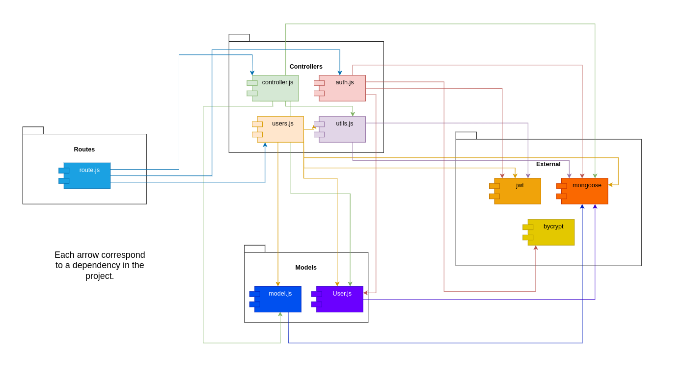

# Test Report

# Contents

- [Dependency graph](#dependency-graph)

- [Integration approach](#integration-approach)

- [Tests](#tests)

- [Coverage](#Coverage)

# Dependency graph

# Integration approach

We decided to go for a white box testing, both in the case of unit and integration tests.

step 1: We performed the unit tests of each single element of the project;

step 2: We started to analyzed the elements in the dependency graph starting from the leaves. `External` and `Models` don't require any test, so we considered `utils.js`. In this module, only `verifyAuth` required an integration test, since the other functions had no dependencies.

step 3: We performed the integration test of all the functions in `controller.js`, `auth.js` and `users.js`, which corresponds to the API testing.

# Tests

| Test Number | Test case name                                                                                                    | Object(s) tested                 | Test level  | Technique used          |
| ----------- | ----------------------------------------------------------------------------------------------------------------- | -------------------------------- | ----------- | ----------------------- |
| 1           | cannot include date with from or upTo                                                                             | handleDateFilterParams           | Unit        | WB - Statement Coverage |
| 2           | Should return a filter if there is only date                                                                      | handleDateFilterParams           | Unit        | WB - Statement Coverage |
| 3           | Should return a filter if there is only from                                                                      | handleDateFilterParams           | Unit        | WB - Statement Coverage |
| 4           | Should return a filter if there is only upTo                                                                      | handleDateFilterParams           | Unit        | WB - Statement Coverage |
| 5           | Should return a filter if there is only from and upTo                                                             | handleDateFilterParams           | Unit        | WB - Statement Coverage |
| 6           | hould have an empty filter if there is not any date filter                                                        | handleDateFilterParams           | Unit        | WB - Statement Coverage |
| 7           | Should has an error if date is not valid                                                                          | handleDateFilterParams           | Unit        | WB - Statement Coverage |
| 8           | Should have an error if dates from and/or upTo are not valid                                                      | handleDateFilterParams           | Unit        | WB - Statement Coverage |
| 9           | Should has an error if date from is not valid                                                                     | handleDateFilterParams           | Unit        | WB - Statement Coverage |
| 10          | Should has an error if date upTo is not valid                                                                     | handleDateFilterParams           | Unit        | WB - Statement Coverage |
| 11          | Should return false if accessToken and/or refreshToken are missing                                                | verifyAuth                       | Unit        | WB - Statement Coverage |
| 12          | Should return false if at least one of the elemets of the accessToken is missing                                  | verifyAuth                       | Unit        | WB - Statement Coverage |
| 13          | Should return false if at least one of the elements of the refreshToken is missing                                | verifyAuth                       | Unit        | WB - Statement Coverage |
| 14          | Should return false if the elements of the accessToken and refreshToken are not consistent                        | verifyAuth                       | Unit        | WB - Statement Coverage |
| 15          | Should return true if the authorization is of type simple                                                         | verifyAuth                       | Unit        | WB - Statement Coverage |
| 16          | Should return true if the authorization is of type user and accessToken is valid                                  | verifyAuth                       | Unit        | WB - Statement Coverage |
| 17          | Should return false if the authorization is of type user and accessToken is not valid                             | verifyAuth                       | Unit        | WB - Statement Coverage |
| 18          | Should return true if the authentication is of type admin and accessToken is valid                                | verifyAuth                       | Unit        | WB - Statement Coverage |
| 19          | Should return false if the authorization is of type admin and accessToken is not valid                            | verifyAuth                       | Unit        | WB - Statement Coverage |
| 20          | Should return true if the authentication is of type Group and accessToken is valid                                | verifyAuth                       | Unit        | WB - Statement Coverage |
| 21          | Should return false if the authorization is of type Group and accessToken is not valid                            | verifyAuth                       | Unit        | WB - Statement Coverage |
| 22          | Should return false if the authorization is of type which is not supported                                        | verifyAuth                       | Unit        | WB - Statement Coverage |
| 23          | Should return true if the authentication is of type simple but the accessToken has been refreshed                 | verifyAuth                       | Unit        | WB - Statement Coverage |
| 24          | Should return true if the authentication is of type user but the accessToken has been refreshed                   | verifyAuth                       | Unit        | WB - Statement Coverage |
| 25          | Should return false if the authentication is of type user but the accessToken has been refreshed and not valid    | verifyAuth                       | Unit        | WB - Statement Coverage |
| 26          | Should return true if the authentication is of type admin but the accessToken has been refreshed                  | verifyAuth                       | Unit        | WB - Statement Coverage |
| 27          | Should return false if the authentication is of type admin but the accessToken has been refreshed and not valid   | verifyAuth                       | Unit        | WB - Statement Coverage |
| 28          | Should return true if the authentication is of type group but the accessToken has been refreshed                  | verifyAuth                       | Unit        | WB - Statement Coverage |
| 29          | Should return false if the authentication is of type group but the accessToken has been refreshed and not valid   | verifyAuth                       | Unit        | WB - Statement Coverage |
| 30          | Should return false if the authorization is of type which is not supported and the accessToken has been refreshed | verifyAuth                       | Unit        | WB - Statement Coverage |
| 31          | Should return false if the accessToken has expired                                                                | verifyAuth                       | Unit        | WB - Statement Coverage |
| 32          | Should return false if there is an other error if the accessToken has expired                                     | verifyAuth                       | Unit        | WB - Statement Coverage |
| 33          | Should return false if there is Other Error                                                                       | verifyAuth                       | Unit        | WB - Statement Coverage |
| 34          | Should return a filter if there is only minAmount                                                                 | handleAmountFilterParams         | Unit        | WB - Statement Coverage |
| 35          | Should return a filter if there is only maxAmount                                                                 | handleAmountFilterParams         | Unit        | WB - Statement Coverage |
| 36          | Should return a filter if there is both minAmount and maxAmount                                                   | handleAmountFilterParams         | Unit        | WB - Statement Coverage |
| 37          | Should have an empty filter if there is not any amount filter                                                     | handleAmountFilterParams         | Unit        | WB - Statement Coverage |
| 38          | Should has an error if min is not a number                                                                        | handleAmountFilterParams         | Unit        | WB - Statement Coverage |
| 39          | Should has an error if max is not a number                                                                        | handleAmountFilterParams         | Unit        | WB - Statement Coverage |
| 40          | Should return 200 if registration has succeeded                                                                   | register                         | Unit        | WB - Statement Coverage |
| 41          | Should return error 400 if the email has an incorrect format                                                      | register                         | Unit        | WB - Statement Coverage |
| 42          | Should return error 400 if the user is already registered                                                         | register                         | Unit        | WB - Statement Coverage |
| 43          | Should return error 500 if error                                                                                  | register                         | Unit        | WB - Statement Coverage |
| 44          | Should return error 400 if is missing an attribute or a parameter is an empty string                              | register                         | Unit        | WB - Statement Coverage |
| 45          | TEST 1: Should return 400, Body error, missing username                                                           | registerAdmin                    | Unit        | WB - Statement Coverage |
| 46          | TEST 2: Should return 400, Body error, missing email                                                              | registerAdmin                    | Unit        | WB - Statement Coverage |
| 47          | TEST 3: Should return 400, Body error, missing password                                                           | registerAdmin                    | Unit        | WB - Statement Coverage |
| 48          | TEST 4: Should return 400, email format error                                                                     | registerAdmin                    | Unit        | WB - Statement Coverage |
| 49          | TEST 5: Should return 400, You are already registered (username)                                                  | registerAdmin                    | Unit        | WB - Statement Coverage |
| 50          | TEST 6: Should return 400, You are already registered (email)                                                     | registerAdmin                    | Unit        | WB - Statement Coverage |
| 51          | TEST 7: Should return 200, User registered successfully                                                           | registerAdmin                    | Unit        | WB - Statement Coverage |
| 52          | TEST 8: Should return 500, catch test                                                                             | registerAdmin                    | Unit        | WB - Statement Coverage |
| 53          | Should return 400 if user does not exist                                                                          | login                            | Unit        | WB - Statement Coverage |
| 54          | Should return 401 if user already logged                                                                          | login                            | Unit        | WB - Statement Coverage |
| 55          | Should return 400 if body empty                                                                                   | login                            | Unit        | WB - Statement Coverage |
| 56          | Should return 400 email is not valid                                                                              | login                            | Unit        | WB - Statement Coverage |
| 57          | Should return 400 if password is not correct                                                                      | login                            | Unit        | WB - Statement Coverage |
| 58          | Should return 500 if error                                                                                        | login                            | Unit        | WB - Statement Coverage |
| 59          | Should return 200 if login is correct                                                                             | login                            | Unit        | WB - Statement Coverage |
| 60          | Should return 200                                                                                                 | logout                           | Unit        | WB - Statement Coverage |
| 61          | Should return 500 if error                                                                                        | logout                           | Unit        | WB - Statement Coverage |
| 62          | Should return 400 if user not found                                                                               | logout                           | Unit        | WB - Statement Coverage |
| 63          | Should return 400 if refresh token does not exist                                                                 | logout                           | Unit        | WB - Statement Coverage |
| 64          | Should create a new Category and return 200                                                                       | createCategory                   | Unit        | WB - Statement Coverage |
| 65          | shold return 401 if not authorized                                                                                | createCategory                   | Unit        | WB - Statement Coverage |
| 66          | Should return 400 if the category already exist                                                                   | createCategory                   | Unit        | WB - Statement Coverage |
| 67          | Should return 500 if error                                                                                        | createCategory                   | Unit        | WB - Statement Coverage |
| 68          | Should return 400 if a parameter is invalid (missing or empty)                                                    | createCategory                   | Unit        | WB - Statement Coverage |
| 69          | Should return 200 if the update is successfull                                                                    | updateCategory                   | Unit        | WB - Statement Coverage |
| 70          | shold return 401 if not authorized                                                                                | updateCategory                   | Unit        | WB - Statement Coverage |
| 71          | Should return 400 if category is not found                                                                        | updateCategory                   | Unit        | WB - Statement Coverage |
| 72          | Should return 400 if category (body type) already exists                                                          | updateCategory                   | Unit        | WB - Statement Coverage |
| 73          | Should return 500 if theres an error on update                                                                    | updateCategory                   | Unit        | WB - Statement Coverage |
| 74          | Should return 400 if a parameter is invalid (missing or empty string)                                             | updateCategory                   | Unit        | WB - Statement Coverage |
| 75          | Should delete the list of types and return 200                                                                    | deleteCategory                   | Unit        | WB - Statement Coverage |
| 76          | Should return 401 if the authorization fails                                                                      | deleteCategory                   | Unit        | WB - Statement Coverage |
| 77          | Should return 400 if a category is not found                                                                      | deleteCategory                   | Unit        | WB - Statement Coverage |
| 78          | Should return 400 if I want to cancel all the categories                                                          | deleteCategory                   | Unit        | WB - Statement Coverage |
| 79          | Should return 500 if the updateMany goes wrong                                                                    | deleteCategory                   | Unit        | WB - Statement Coverage |
| 80          | Should return 400 if a parameter is invalid (missing or empty)                                                    | deleteCategory                   | Unit        | WB - Statement Coverage |
| 81          | TEST 1: return 401, Unauthorized                                                                                  | getCategories                    | Unit        | WB - Statement Coverage |
| 82          | TEST 2: return 200, success                                                                                       | getCategories                    | Unit        | WB - Statement Coverage |
| 83          | TEST 3: return 500, catch tests                                                                                   | getCategories                    | Unit        | WB - Statement Coverage |
| 84          | Should return 404 if not params.username                                                                          | createTransaction                | Unit        | WB - Statement Coverage |
| 85          | Should return 400 if error in body                                                                                | createTransaction                | Unit        | WB - Statement Coverage |
| 86          | Should return 400 if parameter is void string                                                                     | createTransaction                | Unit        | WB - Statement Coverage |
| 87          | Should return 400 not valid float                                                                                 | createTransaction                | Unit        | WB - Statement Coverage |
| 88          | Should return 400 if body and req names are not equal                                                             | createTransaction                | Unit        | WB - Statement Coverage |
| 89          | Should return 401 if not authorized                                                                               | createTransaction                | Unit        | WB - Statement Coverage |
| 90          | Should return 400 if user is not valid                                                                            | createTransaction                | Unit        | WB - Statement Coverage |
| 91          | Should return 400 if category is not valid                                                                        | createTransaction                | Unit        | WB - Statement Coverage |
| 92          | Should return 500 if error                                                                                        | createTransaction                | Unit        | WB - Statement Coverage |
| 93          | Should return 200 if everything works fine                                                                        | createTransaction                | Unit        | WB - Statement Coverage |
| 94          | TEST 1: Should return 401, Unauthorized                                                                           | getAllTransactions               | Unit        | WB - Statement Coverage |
| 95          | TEST 2: Should return 200, success                                                                                | getAllTransactions               | Unit        | WB - Statement Coverage |
| 96          | TEST 3: Should return 500, catch test                                                                             | getAllTransactions               | Unit        | WB - Statement Coverage |
| 97          | Should return transactions with call made by Admin and status 200                                                 | getTransactionsByUser            | Unit        | WB - Statement Coverage |
| 98          | Should return empty array if user dont have transactions with call made by Admin and status 200                   | getTransactionsByUser            | Unit        | WB - Statement Coverage |
| 99          | Should return error 401 if authorization fails while Admin                                                        | getTransactionsByUser            | Unit        | WB - Statement Coverage |
| 100         | Should return error 400 if user dont exist while performing as Admin                                              | getTransactionsByUser            | Unit        | WB - Statement Coverage |
| 101         | Should return error 500 if the aggregate doesnt work properly                                                     | getTransactionsByUser            | Unit        | WB - Statement Coverage |
| 102         | Should return transactions with call made by User and status 200                                                  | getTransactionsByUser            | Unit        | WB - Statement Coverage |
| 103         | Should return empty array if no transactions are present while User and status 200                                | getTransactionsByUser            | Unit        | WB - Statement Coverage |
| 104         | Should return error 401 if authorization fails while User                                                         | getTransactionsByUser            | Unit        | WB - Statement Coverage |
| 105         | Should return error 400 if user dont exist while performing as User                                               | getTransactionsByUser            | Unit        | WB - Statement Coverage |
| 106         | Should return error 500 if the aggregate doesnt work properly                                                     | getTransactionsByUser            | Unit        | WB - Statement Coverage |
| 107         | Should return transactions filtered by user and by category with call made by Admin and status 200                | getTransactionsByUserByCategory  | Unit        | WB - Statement Coverage |
| 108         | Should return empty array if user dont have transactions with call made by Admin and status 200                   | getTransactionsByUserByCategory  | Unit        | WB - Statement Coverage |
| 109         | Should return error 401 if authorization fails while Admin                                                        | getTransactionsByUserByCategory  | Unit        | WB - Statement Coverage |
| 110         | Should return error 400 if user dont exist while performing as Admin                                              | getTransactionsByUserByCategory  | Unit        | WB - Statement Coverage |
| 111         | Should return error 400 if category dont exist while performing as Admin                                          | getTransactionsByUserByCategory  | Unit        | WB - Statement Coverage |
| 112         | Should return error 500 if the aggregate doesnt work properly                                                     | getTransactionsByUserByCategory  | Unit        | WB - Statement Coverage |
| 113         | Should return transactions filter by user and by category with call made by User and status 200                   | getTransactionsByUserByCategory  | Unit        | WB - Statement Coverage |
| 114         | Should return empty array if user dont have transactions with call made by User and status 200                    | getTransactionsByUserByCategory  | Unit        | WB - Statement Coverage |
| 115         | Should return error 401 if authorization fails while User                                                         | getTransactionsByUserByCategory  | Unit        | WB - Statement Coverage |
| 116         | Should return error 400 if user dont exist while performing as Admin                                              | getTransactionsByUserByCategory  | Unit        | WB - Statement Coverage |
| 117         | Should return error 400 if category dont exist while performing as User                                           | getTransactionsByUserByCategory  | Unit        | WB - Statement Coverage |
| 118         | Should return error 500 if the aggregate doesnt work properly                                                     | getTransactionsByUserByCategory  | Unit        | WB - Statement Coverage |
| 119         | TEST 1 : return 400, group does not exist                                                                         | getTransactionsByGroup           | Unit        | WB - Statement Coverage |
| 120         | TEST 2 : return 401, Unauthorized Group                                                                           | getTransactionsByGroup           | Unit        | WB - Statement Coverage |
| 121         | TEST 3 : return 401, Unauthorized Admin                                                                           | getTransactionsByGroup           | Unit        | WB - Statement Coverage |
| 122         | TEST 4 : return 200 (Group)                                                                                       | getTransactionsByGroup           | Unit        | WB - Statement Coverage |
| 123         | TEST 5 : return 200 (Admin)                                                                                       | getTransactionsByGroup           | Unit        | WB - Statement Coverage |
| 124         | TEST 6 : return 200 (Impossible path)                                                                             | getTransactionsByGroup           | Unit        | WB - Statement Coverage |
| 125         | TEST 7 : return 500, catch                                                                                        | getTransactionsByGroup           | Unit        | WB - Statement Coverage |
| 126         | TEST 1: return 400, group does not exist                                                                          | getTransactionsByGroupByCategory | Unit        | WB - Statement Coverage |
| 127         | TEST 2 : return 401, Unauthorized Group                                                                           | getTransactionsByGroupByCategory | Unit        | WB - Statement Coverage |
| 128         | TEST 3 : return 401, Unauthorized Admin                                                                           | getTransactionsByGroupByCategory | Unit        | WB - Statement Coverage |
| 129         | TEST 4 : return 400, category not found                                                                           | getTransactionsByGroupByCategory | Unit        | WB - Statement Coverage |
| 130         | TEST 5 : return 200 (Group)                                                                                       | getTransactionsByGroupByCategory | Unit        | WB - Statement Coverage |
| 131         | TEST 6 : return 200 (Admin)                                                                                       | getTransactionsByGroupByCategory | Unit        | WB - Statement Coverage |
| 132         | TEST 7 : return 200 (Impossible path)                                                                             | getTransactionsByGroupByCategory | Unit        | WB - Statement Coverage |
| 133         | TEST 8 : return 500, catch                                                                                        | getTransactionsByGroupByCategory | Unit        | WB - Statement Coverage |
| 134         | Should delete the transaction and return a success response                                                       | deleteTransaction                | Unit        | WB - Statement Coverage |
| 135         | Should return error 401 if authorization fails while performing as User                                           | deleteTransaction                | Unit        | WB - Statement Coverage |
| 136         | Should return error 400 if the transaction does not exist                                                         | deleteTransaction                | Unit        | WB - Statement Coverage |
| 137         | Should return 400 if the user does not exist                                                                      | deleteTransaction                | Unit        | WB - Statement Coverage |
| 138         | Should return 500 if the transaction cannot be deleted                                                            | deleteTransaction                | Unit        | WB - Statement Coverage |
| 139         | shoul return error 401 if authorization fails while performing as Admin                                           | deleteTransaction                | Unit        | WB - Statement Coverage |
| 140         | Should if transactionId is not defined                                                                            | deleteTransaction                | Unit        | WB - Statement Coverage |
| 141         | Should return 400 id the transactionId is an empty string                                                         | deleteTransaction                | Unit        | WB - Statement Coverage |
| 142         | TEST 1: return 401, authentication failed                                                                         | deleteTransactions               | Unit        | WB - Statement Coverage |
| 143         | TEST 2: Should return 400, Body error: missing field                                                              | deleteTransactions               | Unit        | WB - Statement Coverage |
| 144         | TEST 3: Should return 400, Body error: bad field                                                                  | deleteTransactions               | Unit        | WB - Statement Coverage |
| 145         | TEST 4: Should return 400, Empty string recived                                                                   | deleteTransactions               | Unit        | WB - Statement Coverage |
| 146         | TEST 5: Should return 400, Body error: missing field                                                              | deleteTransactions               | Unit        | WB - Statement Coverage |
| 147         | TEST 6: should return 200, success                                                                                | deleteTransactions               | Unit        | WB - Statement Coverage |
| 148         | TEST 7: Should return status 500, catch test                                                                      | deleteTransactions               | Unit        | WB - Statement Coverage |
| 149         | Should return empty list if there are no users                                                                    | getUsers                         | Unit        | WB - Statement Coverage |
| 150         | Should retrieve list of all users                                                                                 | getUsers                         | Unit        | WB - Statement Coverage |
| 151         | Should return error 401 if not authorized                                                                         | getUsers                         | Unit        | WB - Statement Coverage |
| 152         | Should return error 500 if the search of users went wrong                                                         | getUsers                         | Unit        | WB - Statement Coverage |
| 153         | Should return empty list if there is no group                                                                     | getGroups                        | Unit        | WB - Statement Coverage |
| 154         | Should return the lists of groups if there is any                                                                 | getGroups                        | Unit        | WB - Statement Coverage |
| 155         | Should return error 401 if not authorized                                                                         | getGroups                        | Unit        | WB - Statement Coverage |
| 156         | Should return error 500 if something wrong                                                                        | getGroups                        | Unit        | WB - Statement Coverage |
| 157         | Should return 404 if not params                                                                                   | getUser                          | Unit        | WB - Statement Coverage |
| 158         | Should return 401 if not authorized                                                                               | getUser                          | Unit        | WB - Statement Coverage |
| 159         | Should return 401 if authorized as user for different user                                                        | getUser                          | Unit        | WB - Statement Coverage |
| 160         | Should return 400 if user does not exist                                                                          | getUser                          | Unit        | WB - Statement Coverage |
| 161         | Should return 200 if user exists                                                                                  | getUser                          | Unit        | WB - Statement Coverage |
| 162         | Should return 500 if error                                                                                        | getUser                          | Unit        | WB - Statement Coverage |
| 163         | Should return statu 401, Unauthorized                                                                             | createGroup                      | Unit        | WB - Statement Coverage |
| 164         | Should return 400, the caller is already in a group                                                               | createGroup                      | Unit        | WB - Statement Coverage |
| 165         | Should return 400, Input not valid                                                                                | createGroup                      | Unit        | WB - Statement Coverage |
| 166         | Should return 400, group already exist                                                                            | createGroup                      | Unit        | WB - Statement Coverage |
| 167         | Should return 400, Format of email is not valid                                                                   | createGroup                      | Unit        | WB - Statement Coverage |
| 168         | Should return 400, Members of the group are not valid                                                             | createGroup                      | Unit        | WB - Statement Coverage |
| 169         | Should return 200, caller not included in memberEmails                                                            | createGroup                      | Unit        | WB - Statement Coverage |
| 170         | Should return 200, caller included in memberEmails                                                                | createGroup                      | Unit        | WB - Statement Coverage |
| 171         | Should return status 500, catch test                                                                              | createGroup                      | Unit        | WB - Statement Coverage |
| 172         | Should return 404 if param not valid                                                                              | getGroup                         | Unit        | WB - Statement Coverage |
| 173         | Should return 400 if the group does not exist                                                                     | getGroup                         | Unit        | WB - Statement Coverage |
| 174         | Should return 401 if not authorized                                                                               | getGroup                         | Unit        | WB - Statement Coverage |
| 175         | Should return 200 if group exists and authorized                                                                  | getGroup                         | Unit        | WB - Statement Coverage |
| 176         | Should return 500 if error occurs                                                                                 | getGroup                         | Unit        | WB - Statement Coverage |
| 177         | Should return 404 if not params.name                                                                              | addToGroup                       | Unit        | WB - Statement Coverage |
| 178         | Should return 400 if not body.emails                                                                              | addToGroup                       | Unit        | WB - Statement Coverage |
| 179         | Should return 400 if body.emails has no emails                                                                    | addToGroup                       | Unit        | WB - Statement Coverage |
| 180         | Should return 400 if body.emails has one invalid email                                                            | addToGroup                       | Unit        | WB - Statement Coverage |
| 181         | Should return 401 if not authorized as admin                                                                      | addToGroup                       | Unit        | WB - Statement Coverage |
| 182         | Should return 401 if user not in group                                                                            | addToGroup                       | Unit        | WB - Statement Coverage |
| 183         | Should return 400 if group does not exist                                                                         | addToGroup                       | Unit        | WB - Statement Coverage |
| 184         | Should return 400 if all the members are already in a group                                                       | addToGroup                       | Unit        | WB - Statement Coverage |
| 185         | Should return 200 if we can add at least once                                                                     | addToGroup                       | Unit        | WB - Statement Coverage |
| 186         | Should return 500 if error                                                                                        | addToGroup                       | Unit        | WB - Statement Coverage |
| 187         | Should return 404 not valid req.params.name                                                                       | removeFromGroup                  | Unit        | WB - Statement Coverage |
| 188         | Should return 400 if not valid body.emails                                                                        | removeFromGroup                  | Unit        | WB - Statement Coverage |
| 189         | Should return 400 if body.emails not an array                                                                     | removeFromGroup                  | Unit        | WB - Statement Coverage |
| 190         | Should return 400 if at least one email is not valid                                                              | removeFromGroup                  | Unit        | WB - Statement Coverage |
| 191         | Should return 400 if the group does not exist                                                                     | removeFromGroup                  | Unit        | WB - Statement Coverage |
| 192         | Should return 400 if there is only one member in the group                                                        | removeFromGroup                  | Unit        | WB - Statement Coverage |
| 193         | Should return 401 if not authorized in group                                                                      | removeFromGroup                  | Unit        | WB - Statement Coverage |
| 194         | Should return 401 if not authorized ad admin                                                                      | removeFromGroup                  | Unit        | WB - Statement Coverage |
| 195         | Should return 500 if error                                                                                        | removeFromGroup                  | Unit        | WB - Statement Coverage |
| 196         | Should return 400 if all the memberEmails either do not exist or not in group                                     | removeFromGroup                  | Unit        | WB - Statement Coverage |
| 197         | Should return 200 if it was possible to remove some members                                                       | removeFromGroup                  | Unit        | WB - Statement Coverage |
| 198         | Should return 200 if it was possible to remove all the members except the first one                               | removeFromGroup                  | Unit        | WB - Statement Coverage |
| 199         | Should delete the user and return a success response                                                              | deleteUser                       | Unit        | WB - Statement Coverage |
| 200         | Should return 401 if user is not authorized                                                                       | deleteUser                       | Unit        | WB - Statement Coverage |
| 201         | Should return 400 if user does not exist                                                                          | deleteUser                       | Unit        | WB - Statement Coverage |
| 202         | shoul return 400 if request does not contain email                                                                | deleteUser                       | Unit        | WB - Statement Coverage |
| 203         | Should return 400 if the email is empty                                                                           | deleteUser                       | Unit        | WB - Statement Coverage |
| 204         | Should return 400 if the email is not valid                                                                       | deleteUser                       | Unit        | WB - Statement Coverage |
| 205         | Should return 500 if there is an error while deleting the user                                                    | deleteUser                       | Unit        | WB - Statement Coverage |
| 206         | Should return 200 if successful and the user is the last member of the group                                      | deleteUser                       | Unit        | WB - Statement Coverage |
| 207         | Should return 400 if you try to delete an admin                                                                   | deleteUser                       | Unit        | WB - Statement Coverage |
| 208         | Should return 200 if the user is deleted and he does not belong to any group                                      | deleteUser                       | Unit        | WB - Statement Coverage |
| 209         | Should delete the group and return a success response                                                             | deleteGroup                      | Unit        | WB - Statement Coverage |
| 210         | Should return an error response if authentication fails                                                           | deleteGroup                      | Unit        | WB - Statement Coverage |
| 211         | Should return an error response if the group does not exist                                                       | deleteGroup                      | Unit        | WB - Statement Coverage |
| 212         | Should return an error response if there is an error while deleting the group                                     | deleteGroup                      | Unit        | WB - Statement Coverage |
| 213         | Should return an error response if the name is not valid                                                          | deleteGroup                      | Unit        | WB - Statement Coverage |
| 214         | Should return an error response if the name is not provided                                                       | deleteGroup                      | Unit        | WB - Statement Coverage |
| 215         | Should return false if accessToken and/or refreshToken are missing                                                | verifyAuth                       | Integration | WB - Statement Coverage |
| 216         | Should return false if at least one of the elemets of the accessToken is missing                                  | verifyAuth                       | Integration | WB - Statement Coverage |
| 217         | Should return false if at least one of the elements of the refreshToken is missing                                | verifyAuth                       | Integration | WB - Statement Coverage |
| 218         | Should return false if the elements of the accessToken and refreshToken are not consistent                        | verifyAuth                       | Integration | WB - Statement Coverage |
| 219         | Should return true if the authorization is of type simple                                                         | verifyAuth                       | Integration | WB - Statement Coverage |
| 220         | Should return true if the authorization is of type user and accessToken is valid                                  | verifyAuth                       | Integration | WB - Statement Coverage |
| 221         | Should return false if the authorization is of type user and accessToken is not valid                             | verifyAuth                       | Integration | WB - Statement Coverage |
| 222         | Should return true if the authentication is of type admin and accessToken is valid                                | verifyAuth                       | Integration | WB - Statement Coverage |
| 223         | Should return true if the authentication is of type admin and accessToken is not valid                            | verifyAuth                       | Integration | WB - Statement Coverage |
| 224         | Should return true if the authentication is of type Group and accessToken is valid                                | verifyAuth                       | Integration | WB - Statement Coverage |
| 225         | Should return true if the authentication is of type Group and accessToken is not valid                            | verifyAuth                       | Integration | WB - Statement Coverage |
| 226         | Should return false if the authorization is of type which is not supported                                        | verifyAuth                       | Integration | WB - Statement Coverage |
| 227         | Should return true if the authentication is of type simple but the accessToken has been refreshed                 | verifyAuth                       | Integration | WB - Statement Coverage |
| 228         | Should return true if the authentication is of type user but the accessToken has been refreshed                   | verifyAuth                       | Integration | WB - Statement Coverage |
| 229         | Should return false if the authentication is of type user but the accessToken has been refreshed and not valid    | verifyAuth                       | Integration | WB - Statement Coverage |
| 230         | Should return true if the authentication is of type admin but the accessToken has been refreshed                  | verifyAuth                       | Integration | WB - Statement Coverage |
| 231         | Should return false if the authentication is of type admin but the accessToken has been refreshed and not valid   | verifyAuth                       | Integration | WB - Statement Coverage |
| 232         | Should return true if the authentication is of type group but the accessToken has been refreshed                  | verifyAuth                       | Integration | WB - Statement Coverage |
| 233         | Should return false if the authentication is of type group but the accessToken has been refreshed and not valid   | verifyAuth                       | Integration | WB - Statement Coverage |
| 234         | Should return false if the authorization is of type which is not supported and the accessToken has been refreshed | verifyAuth                       | Integration | WB - Statement Coverage |
| 235         | Should return false if the accessToken has expired                                                                | verifyAuth                       | Integration | WB - Statement Coverage |
| 236         | Should return 400 if the email has an incorrect form                                                              | register                         | API         | WB - Statement Coverage |
| 237         | Should return 400 if the user is already registered                                                               | register                         | API         | WB - Statement Coverage |
| 238         | Should return 400 if a parameter (body) is missing                                                                | register                         | API         | WB - Statement Coverage |
| 239         | Should return 200 if everything work fine                                                                         | register                         | API         | WB - Statement Coverage |
| 240         | TEST 1: Should return 400,                                                                                        | registerAdmin                    | API         | WB - Statement Coverage |
| 241         | TEST 2: Should return 400, Invalid mail                                                                           | registerAdmin                    | API         | WB - Statement Coverage |
| 242         | TEST 3: Should return 400, username or mail already in DB                                                         | registerAdmin                    | API         | WB - Statement Coverage |
| 243         | TEST 4: Should return 200, success                                                                                | registerAdmin                    | API         | WB - Statement Coverage |
| 244         | Should return 400 if user does not exist                                                                          | login                            | API         | WB - Statement Coverage |
| 245         | Should return 401 if user already logged                                                                          | login                            | API         | WB - Statement Coverage |
| 246         | Should return 400 if body empty                                                                                   | login                            | API         | WB - Statement Coverage |
| 247         | Should return 400 email is not valid                                                                              | login                            | API         | WB - Statement Coverage |
| 248         | Should return 400 if password is not correct                                                                      | login                            | API         | WB - Statement Coverage |
| 249         | Should return 200 if login is correct                                                                             | login                            | API         | WB - Statement Coverage |
| 250         | Should return 200 if user is logged out                                                                           | logout                           | API         | WB - Statement Coverage |
| 251         | Should return 400 if refreshToken does not exist                                                                  | logout                           | API         | WB - Statement Coverage |
| 252         | Should return 400 if user does not exist                                                                          | logout                           | API         | WB - Statement Coverage |
| 253         | Should return 500 if error                                                                                        | logout                           | API         | WB - Statement Coverage |
| 254         | Should return 400 if error in body                                                                                | createCategory                   | API         | WB - Statement Coverage |
| 255         | Should return 400 if parameter is void string                                                                     | createCategory                   | API         | WB - Statement Coverage |
| 256         | Should return 401 if not authorized                                                                               | createCategory                   | API         | WB - Statement Coverage |
| 257         | Should return 400 if category already exist                                                                       | createCategory                   | API         | WB - Statement Coverage |
| 258         | Should return 200 if I created the category without errors                                                        | createCategory                   | API         | WB - Statement Coverage |
| 259         | Should retunr 401 if not authorized                                                                               | updateCategory                   | API         | WB - Statement Coverage |
| 260         | Should return 400 if category is not found                                                                        | updateCategory                   | API         | WB - Statement Coverage |
| 261         | Should return 400 if category (body type) already exists                                                          | updateCategory                   | API         | WB - Statement Coverage |
| 262         | Should return 400 if a parameter is invalid (missing or empty string)                                             | updateCategory                   | API         | WB - Statement Coverage |
| 263         | Should return 200 if the update is successfull                                                                    | updateCategory                   | API         | WB - Statement Coverage |
| 264         | Should retunr 401 if not authorized                                                                               | deleteCategory                   | API         | WB - Statement Coverage |
| 265         | Should return 400 if request body does not contain the necessary attributes                                       | deleteCategory                   | API         | WB - Statement Coverage |
| 266         | Should return 400 if parameters contain an empty string                                                           | deleteCategory                   | API         | WB - Statement Coverage |
| 267         | Should return 400 if a category (from req body) does not exist                                                    | deleteCategory                   | API         | WB - Statement Coverage |
| 268         | Should return 400 if there is only one category in the db (cannot cancel every category)                          | deleteCategory                   | API         | WB - Statement Coverage |
| 269         | Should return 200 if everything work fine                                                                         | deleteCategory                   | API         | WB - Statement Coverage |
| 270         | TEST 1: return 400, Unauthorized                                                                                  | getCategories                    | API         | WB - Statement Coverage |
| 271         | TEST 2: return 200, success                                                                                       | getCategories                    | API         | WB - Statement Coverage |
| 272         | Should return 404 if not params.username                                                                          | createTransaction                | API         | WB - Statement Coverage |
| 273         | Should return 400 if error in body                                                                                | createTransaction                | API         | WB - Statement Coverage |
| 274         | Should return 400 if parameter is void string                                                                     | createTransaction                | API         | WB - Statement Coverage |
| 275         | Should return 400 not valid float                                                                                 | createTransaction                | API         | WB - Statement Coverage |
| 276         | Should return 400 if body and req names are not equal                                                             | createTransaction                | API         | WB - Statement Coverage |
| 277         | Should return 401 if not authorized                                                                               | createTransaction                | API         | WB - Statement Coverage |
| 278         | Should return 400 if user is not valid                                                                            | createTransaction                | API         | WB - Statement Coverage |
| 279         | Should return 400 if category is not valid                                                                        | createTransaction                | API         | WB - Statement Coverage |
| 280         | Should return 200 if everything works fine                                                                        | createTransaction                | API         | WB - Statement Coverage |
| 281         | TEST 1, Should return 400                                                                                         | getAllTransactions               | API         | WB - Statement Coverage |
| 282         | TEST 2, Should return 200                                                                                         | getAllTransactions               | API         | WB - Statement Coverage |
| 283         | Should return transactions with call made by Admin and status 200                                                 | getTransactionsByUser            | API         | WB - Statement Coverage |
| 284         | Should return void list transactions if no transactions with call made by Admin and status 200                    | getTransactionsByUser            | API         | WB - Statement Coverage |
| 285         | Should return 401 if not authorized                                                                               | getTransactionsByUser            | API         | WB - Statement Coverage |
| 286         | Should return 400 if the user does not exist                                                                      | getTransactionsByUser            | API         | WB - Statement Coverage |
| 287         | Should return transactions with call made by User and status 200                                                  | getTransactionsByUser            | API         | WB - Statement Coverage |
| 288         | Should return empty array if no transactions are present while User and status 200                                | getTransactionsByUser            | API         | WB - Statement Coverage |
| 289         | Should return error 401 if authorization fails while User                                                         | getTransactionsByUser            | API         | WB - Statement Coverage |
| 290         | Should return error 400 if the user does not exist                                                                | getTransactionsByUser            | API         | WB - Statement Coverage |
| 291         | Should return transactions filtered by user and by category with call made by Admin and status 200                | getTransactionsByUserByCategory  | API         | WB - Statement Coverage |
| 292         | Should return empty array if user dont have transactions with call made by Admin and status 200                   | getTransactionsByUserByCategory  | API         | WB - Statement Coverage |
| 293         | Should return error 401 if authorization fails while Admin                                                        | getTransactionsByUserByCategory  | API         | WB - Statement Coverage |
| 294         | Should return error 400 if user dont exist while performing as Admin                                              | getTransactionsByUserByCategory  | API         | WB - Statement Coverage |
| 295         | Should return error 400 if category dont exist while performing as Admin                                          | getTransactionsByUserByCategory  | API         | WB - Statement Coverage |
| 296         | Should return transactions filter by user and by category with call made by User and status 200                   | getTransactionsByUserByCategory  | API         | WB - Statement Coverage |
| 297         | Should return empty array if user dont have transactions with call made by User and status 200                    | getTransactionsByUserByCategory  | API         | WB - Statement Coverage |
| 298         | Should return error 401 if authorization fails while User                                                         | getTransactionsByUserByCategory  | API         | WB - Statement Coverage |
| 299         | Should return error 400 if category dont exist while performing as User                                           | getTransactionsByUserByCategory  | API         | WB - Statement Coverage |
| 300         | Should return error 400 if user dont exist while performing as User                                               | getTransactionsByUserByCategory  | API         | WB - Statement Coverage |
| 301         | TEST 1: return 400, Group does not exist                                                                          | getTransactionsByGroup           | API         | WB - Statement Coverage |
| 302         | TEST 2: return 401, failed auth user                                                                              | getTransactionsByGroup           | API         | WB - Statement Coverage |
| 303         | TEST 3: return 401, failed auth admin                                                                             | getTransactionsByGroup           | API         | WB - Statement Coverage |
| 304         | TEST 4: return 200 (User)                                                                                         | getTransactionsByGroup           | API         | WB - Statement Coverage |
| 305         | TEST 5: return 200 (admin)                                                                                        | getTransactionsByGroup           | API         | WB - Statement Coverage |
| 306         | TEST 1: return 400, Group does not exist                                                                          | getTransactionsByGroupByCategory | API         | WB - Statement Coverage |
| 307         | TEST 2: return 401, failed auth user                                                                              | getTransactionsByGroupByCategory | API         | WB - Statement Coverage |
| 308         | TEST 3: return 401, failed auth admin                                                                             | getTransactionsByGroupByCategory | API         | WB - Statement Coverage |
| 309         | TEST 4: return 400. category not found                                                                            | getTransactionsByGroupByCategory | API         | WB - Statement Coverage |
| 310         | TEST 5: return 200 (User)                                                                                         | getTransactionsByGroupByCategory | API         | WB - Statement Coverage |
| 311         | TEST 6: return 200 (admin)                                                                                        | getTransactionsByGroupByCategory | API         | WB - Statement Coverage |
| 312         | Should delete the transaction and return a success response                                                       | deleteTransaction                | API         | WB - Statement Coverage |
| 313         | Should return error 401 if authorization fails while performing as User                                           | deleteTransaction                | API         | WB - Statement Coverage |
| 314         | Should return error 400 if the transaction does not exist                                                         | deleteTransaction                | API         | WB - Statement Coverage |
| 315         | Should return 400 if the user does not exist                                                                      | deleteTransaction                | API         | WB - Statement Coverage |
| 316         | Should return 500 if the transaction cannot be deleted                                                            | deleteTransaction                | API         | WB - Statement Coverage |
| 317         | shoul return error 401 if authorization fails while performing as Admin                                           | deleteTransaction                | API         | WB - Statement Coverage |
| 318         | Should if transactionId is not defined                                                                            | deleteTransaction                | API         | WB - Statement Coverage |
| 319         | Should return 400 id the transactionId is an empty string                                                         | deleteTransaction                | API         | WB - Statement Coverage |
| 320         | TEST 1: Should return 401, Unauthorized                                                                           | deleteTransactions               | API         | WB - Statement Coverage |
| 321         | TEST 2: Should return 400, Body errors                                                                            | deleteTransactions               | API         | WB - Statement Coverage |
| 322         | TEST 3: Should return 400, id is a void string                                                                    | deleteTransactions               | API         | WB - Statement Coverage |
| 323         | TEST 4: Should return 400, ids not in the DB                                                                      | deleteTransactions               | API         | WB - Statement Coverage |
| 324         | TEST 5: Should return 200, ids not in the DB                                                                      | deleteTransactions               | API         | WB - Statement Coverage |
| 325         | Should return 401 if not authorized                                                                               | getUsers                         | API         | WB - Statement Coverage |
| 326         | Should return 200 if no errors occur                                                                              | getUsers                         | API         | WB - Statement Coverage |
| 327         | Should return 404 if not params                                                                                   | getUser                          | API         | WB - Statement Coverage |
| 328         | Should return 401 if not authorized                                                                               | getUser                          | API         | WB - Statement Coverage |
| 329         | Should return 401 if authorized as user for different user                                                        | getUser                          | API         | WB - Statement Coverage |
| 330         | Should return 400 if user does not exist                                                                          | getUser                          | API         | WB - Statement Coverage |
| 331         | Should return 200 if user exists                                                                                  | getUser                          | API         | WB - Statement Coverage |
| 332         | TEST 1: return 401, Unauthorized                                                                                  | createGroup                      | API         | WB - Statement Coverage |
| 333         | TEST 2: return 400, Youre already in a group                                                                      | createGroup                      | API         | WB - Statement Coverage |
| 334         | TEST 3: return 400, Input not valid                                                                               | createGroup                      | API         | WB - Statement Coverage |
| 335         | TEST 4: return 400, Group already exists                                                                          | createGroup                      | API         | WB - Statement Coverage |
| 336         | TEST 5: return 400, Group already exists                                                                          | createGroup                      | API         | WB - Statement Coverage |
| 337         | TEST 6: return 400, Group already exists                                                                          | createGroup                      | API         | WB - Statement Coverage |
| 338         | TEST 7: return 200, success                                                                                       | createGroup                      | API         | WB - Statement Coverage |
| 339         | Should return empty list if there is no group                                                                     | getGroups                        | API         | WB - Statement Coverage |
| 340         | Should return empty list if there is no group                                                                     | getGroups                        | API         | WB - Statement Coverage |
| 341         | Should return error 401 if not authorized                                                                         | getGroups                        | API         | WB - Statement Coverage |
| 342         | Should return 404 if param not valid                                                                              | getGroup                         | API         | WB - Statement Coverage |
| 343         | Should return 400 if the group does not exist                                                                     | getGroup                         | API         | WB - Statement Coverage |
| 344         | Should return 401 if not authorized                                                                               | getGroup                         | API         | WB - Statement Coverage |
| 345         | Should return 200 if group exists and authorized                                                                  | getGroup                         | API         | WB - Statement Coverage |
| 346         | Should return 404 if not params.name                                                                              | addToGroup                       | API         | WB - Statement Coverage |
| 347         | Should return 400 if not body.emails                                                                              | addToGroup                       | API         | WB - Statement Coverage |
| 348         | Should return 400 if body.emails has no emails                                                                    | addToGroup                       | API         | WB - Statement Coverage |
| 349         | Should return 400 if body.emails has one invalid email                                                            | addToGroup                       | API         | WB - Statement Coverage |
| 350         | Should return 401 if not authorized as admin                                                                      | addToGroup                       | API         | WB - Statement Coverage |
| 351         | Should return 401 if user not in group                                                                            | addToGroup                       | API         | WB - Statement Coverage |
| 352         | Should return 400 if group does not exist                                                                         | addToGroup                       | API         | WB - Statement Coverage |
| 353         | Should return 400 if all the members are already in a group                                                       | addToGroup                       | API         | WB - Statement Coverage |
| 354         | Should return 200 if we can add at least once                                                                     | addToGroup                       | API         | WB - Statement Coverage |
| 355         | Should return 404 if not params.name                                                                              | removeFromGroup                  | API         | WB - Statement Coverage |
| 356         | Should return 400 if not valid body.emails                                                                        | removeFromGroup                  | API         | WB - Statement Coverage |
| 357         | Should return 400 if body.emails not an array                                                                     | removeFromGroup                  | API         | WB - Statement Coverage |
| 358         | Should return 400 if at least one email is not valid                                                              | removeFromGroup                  | API         | WB - Statement Coverage |
| 359         | Should return 400 if group does not exist                                                                         | removeFromGroup                  | API         | WB - Statement Coverage |
| 360         | Should return 400 if there is only one member in the group                                                        | removeFromGroup                  | API         | WB - Statement Coverage |
| 361         | Should return 401 if not authorized in group                                                                      | removeFromGroup                  | API         | WB - Statement Coverage |
| 362         | Should return 401 if not authorized as admin                                                                      | removeFromGroup                  | API         | WB - Statement Coverage |
| 363         | Should return 400 if all membersEmail either do not exist or not in group                                         | removeFromGroup                  | API         | WB - Statement Coverage |
| 364         | Should return 200 if it was possible to remove some members                                                       | removeFromGroup                  | API         | WB - Statement Coverage |
| 365         | Should return 200 if it was possible to remove all the members except the first one                               | removeFromGroup                  | API         | WB - Statement Coverage |
| 366         | Should delete the user and return a success response                                                              | deleteUser                       | API         | WB - Statement Coverage |
| 367         | Should return 401 if user is not authorized                                                                       | deleteUser                       | API         | WB - Statement Coverage |
| 368         | Should return 400 if user does not exist                                                                          | deleteUser                       | API         | WB - Statement Coverage |
| 369         | Should return 400 if request does not contain email                                                               | deleteUser                       | API         | WB - Statement Coverage |
| 370         | Should return 400 if the email is empty                                                                           | deleteUser                       | API         | WB - Statement Coverage |
| 371         | Should return 400 if the email is not valid                                                                       | deleteUser                       | API         | WB - Statement Coverage |
| 372         | Should return 500 if there is an error while deleting the user                                                    | deleteUser                       | API         | WB - Statement Coverage |
| 373         | Should return 200 if successful and the user is the last member of the group                                      | deleteUser                       | API         | WB - Statement Coverage |
| 374         | Should return 400 if you try to delete an admin                                                                   | deleteUser                       | API         | WB - Statement Coverage |
| 375         | Should return 200 if the user is deleted and he does not belong to any group                                      | deleteUser                       | API         | WB - Statement Coverage |
| 376         | Should delete the group and return a success response                                                             | deleteGroup                      | API         | WB - Statement Coverage |
| 377         | Should return an error response if authentication fails                                                           | deleteGroup                      | API         | WB - Statement Coverage |
| 378         | Should return an error response if the group does not exist                                                       | deleteGroup                      | API         | WB - Statement Coverage |
| 379         | Should return an error response if there is an error while deleting the group                                     | deleteGroup                      | API         | WB - Statement Coverage |
| 380         | Should return an error response if the name is not valid                                                          | deleteGroup                      | API         | WB - Statement Coverage |
| 381         | Should return an error response if the name is not provided                                                       | deleteGroup                      | API         | WB - Statement Coverage |

# Coverage

## Coverage of FR

<Report in the following table the coverage of functional requirements (from official requirements) >

| Functional Requirements covered | Test(s)          |
| ------------------------------- | ---------------- |
| FRx                             |                  |
| FRy                             |                  |
| ...                             |                  |
| FR11                            | 40; 239          |
| FR12                            | 59; 249          |
| FR13                            | 60; 250          |
| FR14                            | 51; 243          |
| FR15                            | 150; 326         |
| FR15                            | 161; 331         |
| FR16                            | 206,208; 373,375 |
| FR21                            | 169-170; 338     |
| FR22                            | 153-154; 339-340 |
| FR23                            | 175; 345         |
| FR24                            | 185; 354         |
| FR26                            | 197-198; 364-365 |
| FR28                            | 209; 376         |
| FR31                            | 93; 280          |
| FR32                            | 95; 282          |
| FR33                            | 97-98; 283-284   |
| FR34                            | 107-108; 291-292 |
| FR35                            | 122-124; 304-305 |
| FR36                            | 130-131; 310-311 |
| FR37                            | 134; 312         |
| FR38                            | 147; 324         |
| FR41                            | 64; 258          |
| FR42                            | 69; 263          |
| FR43                            | 75; 269          |
| FR44                            | 82; 271          |

## Coverage white box

Report here the screenshot of coverage values obtained with jest-- coverage
